# Animum/Mercury
Data-generation-based pokemon creator    

## Intro
As a toy project, my team(Animum) has been developing a pokemon generator with various GAN(Generative Adversial Network) models. 
We are currently working on selfie-to-pokemon, sketch-to-pokemon, and random-seed-to-pokemon generator. 
    
We succeded in generating pokemon-like high-resolution(up to 1024x1024) creatures. Some of them look cute, magnificent, friendly, but the other look creepy.    

You can generate pokemon from your selfie in our [demo page](http://animum.site/selfie-to-pokemon). Don't worry, no selfie image is saved anywhere. 

## Pipeline
### Upload Selfie
You can upload your selfie(or any other photo) that you would like to convert into new pokemon

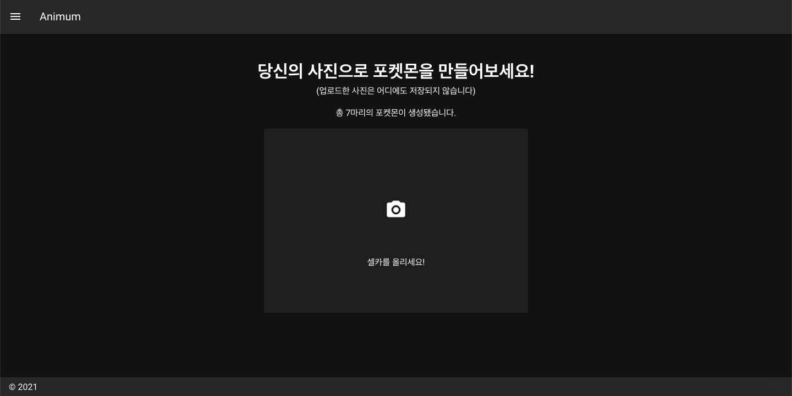

### Face Detection
You can check the cropped face and heatmap image of your selfie

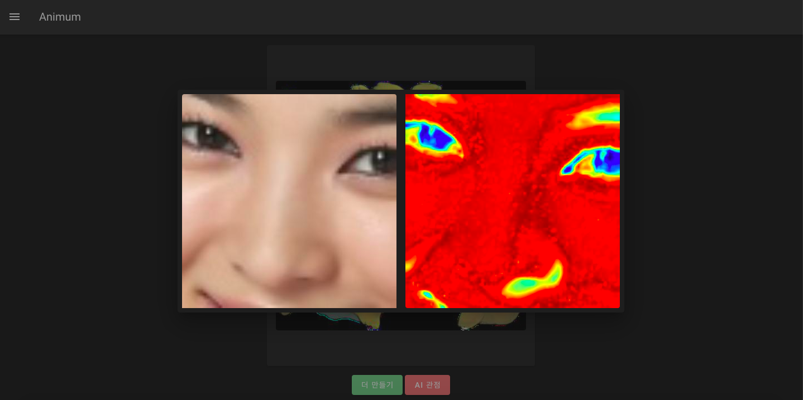

We exploited `haar cascade detector` for [face detection](https://www.cs.cmu.edu/~efros/courses/LBMV07/Papers/viola-cvpr-01.pdf)

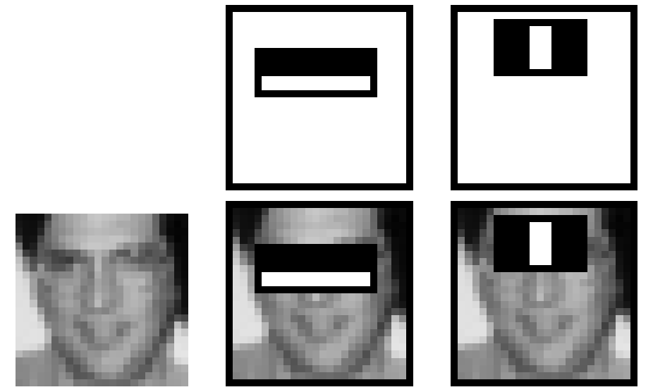

### Style Transfer
The model will then create a new pokemon with extracted feature of your selfie

We trained a modified version of '[U-GAT-IT](https://arxiv.org/abs/1907.10830)' model with '[The Asian Face Age Dataset](https://afad-dataset.github.io/)' and '[Pokemon Dataset](https://www.kaggle.com/kvpratama/pokemon-images-dataset)'. Original code we used is available at [here](https://github.com/znxlwm/UGATIT-pytorch).

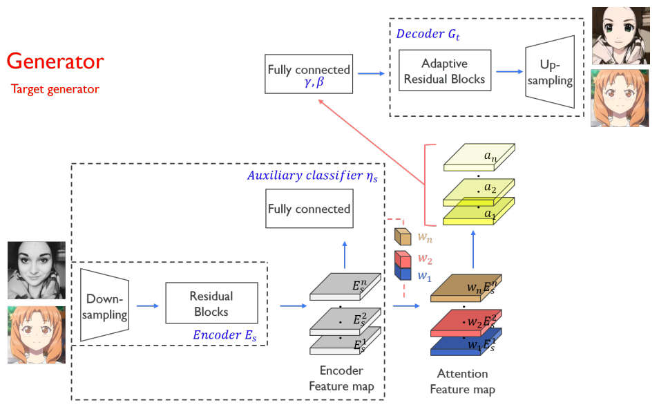

## Training
We present generated pokemon during training procedure. You can see that the model tries to capture the form of pokemons first, and then put the detailed textures.

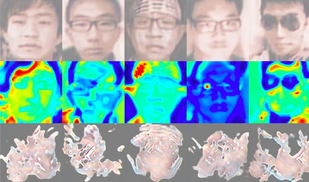

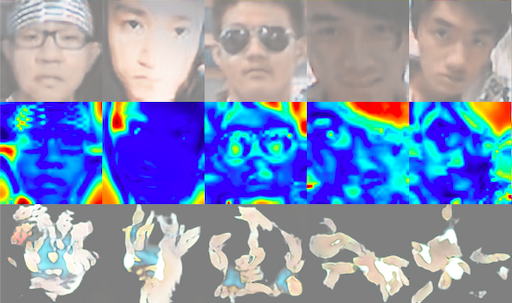

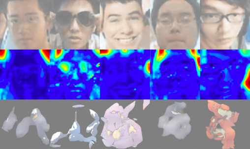

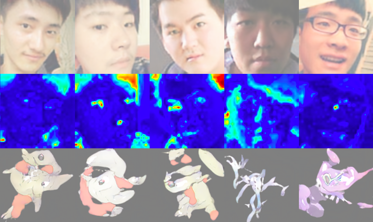

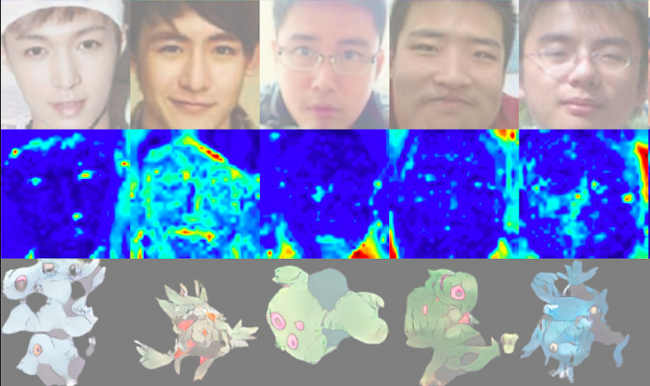

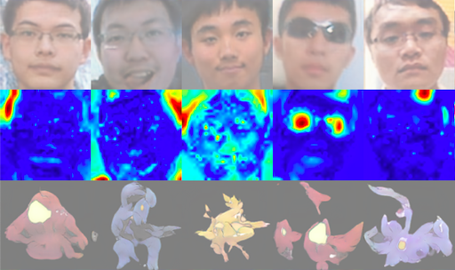

## Test
We are currently developing better models and training techniques for better performance. Please get ready for the next version.

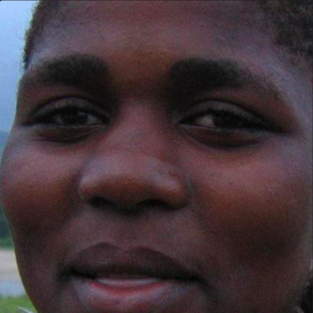
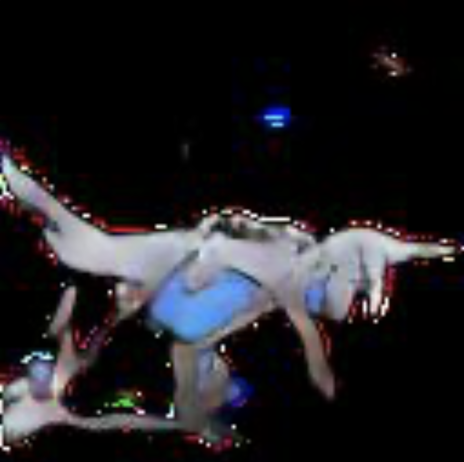

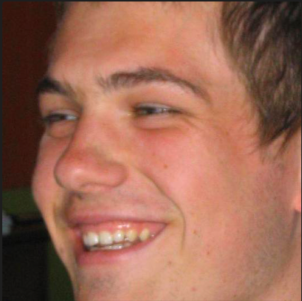
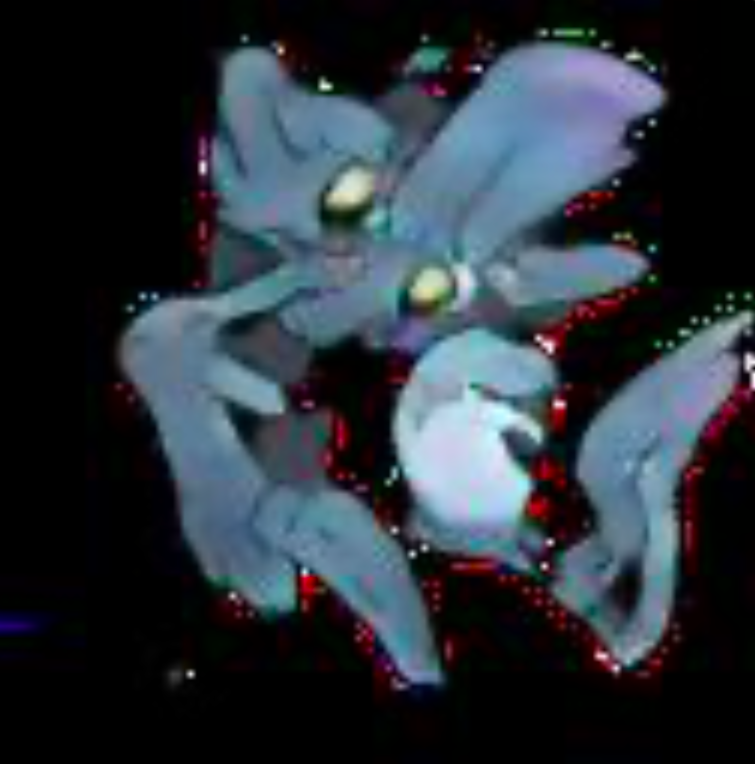

## Contributors
- https://github.com/gimme1dollar  
- https://github.com/seunghyukcho 
- https://github.com/jhchoi0630
- https://github.com/hy2881
